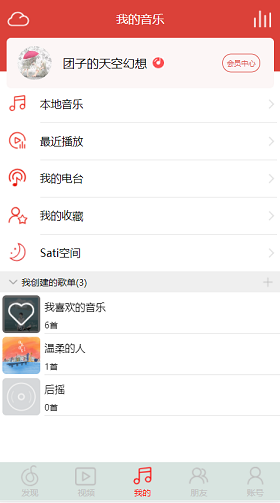

# cloud-music   
  背景： 本人大二在校生，学习前端半年，使用vue全家桶仿写iOS的网易云音乐app练手   
  如果您发现有什么问题或是有什么想法，欢迎issues和PR   
  如果您觉得这个cloudmusic还算不错，欢迎star，非常感谢您的认可和鼓励

## 技术栈  
  vue2.4 + vue-cli3 + vue-router + vuex + axios

## 使用到的工具
  vue-lazyload: 实现图片懒加载   
  fastclick: 解决移动端点击300ms延迟
  
## 安装运行
```
克隆项目     
git clone https://github.com/DangoSky/cloud-music.git   

安装依赖   
npm install   

开发环境运行    
npm run serve  

生产环境构建   
npm run build 
```

## 功能实现     
 - [x] 网易云音乐app的五个模块()     
 - [x] 基本的播放暂停、上下一曲
 - [x] 播放顺序调整、进度条拖拽
 - [x] 歌词滚动   
 - [x] 音乐搜索
 - [x] 推荐歌单  
 - [x] 推荐MV  
 - [x] 增删改查歌单(使用localStorage存储，右滑可以删除歌单或将歌曲移出歌单)   
 - [ ] 查看歌曲评论  
 - [ ] 用户登陆
 - [ ] 查看动态  
  ······
 > 因手头任务需要，cloudmusic的开发暂告一段落，等以后有时间再继续开发新功能

## 预览
> 使用的是学生服务器,带宽较小，初次体验可能会加载得比较慢

  **[在线体验](http://dangosky.com/cloudmusic)**(PC端推荐使用chrome或firefox预览)    
  (推荐使用Android手机微信扫码预览,暂不支持iOS播放)  

### 项目截图
  
  
  
  
  

## 鸣谢
  [网易云音乐 NodeJS 版 API](https://github.com/Binaryify/NeteaseCloudMusicApi)    
  [网易云音乐（Cloudmusic）API](https://zhuanlan.zhihu.com/p/30246788)   
  [Iconfont](https://www.iconfont.cn/?spm=a313x.7781069.1998910419.d4d0a486a)


